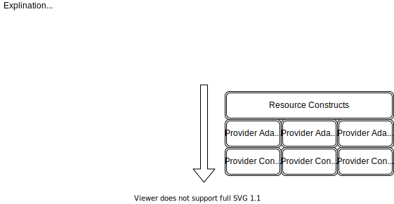

# CDK TF Resources

Proof of Concept for an opinionated cdk build.

- [CDK TF Resources](#cdk-tf-resources)
  - [Mission Statement](#mission-statement)

## Mission Statement

Terraform allows deploying resources to many different cloud providers, but it is not intuitive.

Think of  a way to deploy common constructs onto different providers.

```ts
class Site extends cdktf.Resource {
  constructor(scope: cdktf.Construct, name: string, props?: SiteProps) {
    super(scope, name)

    this.provider: props.provider

    this.resource = new SiteAdapters[this.provider](...props)
  }

  SiteAdapters = {
    'cloudflare': CloudFlarePagesResource
  }
}
```


